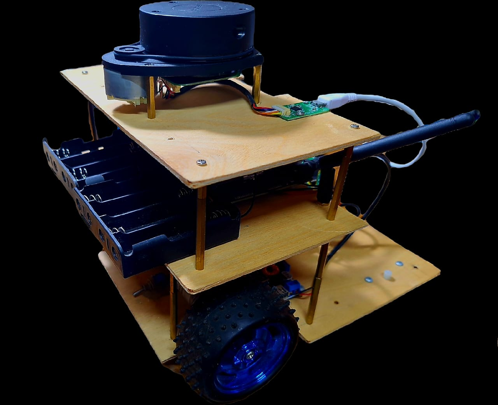
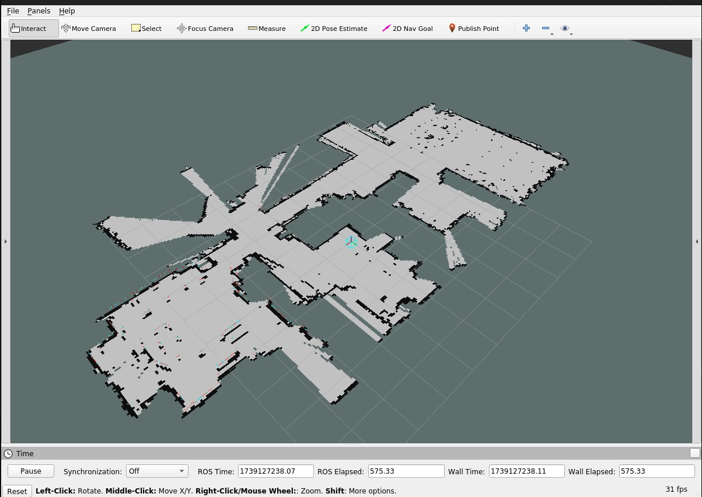

# Mobile Robot Project (ROS 1 – Noetic)


## Hardware Configuration

### Mechanical Structure
- **Drive System**: Differential drive mobile robot
- **Wheelbase**: 187mm (center-to-center wheel distance)
- **Wheel Specifications**: 
  - Diameter: 80mm (derived from radius = 0.04m)
  - Motorized wheels: 2
  - Encoder-equipped: Yes (330 CPR encoders)

### Sensor Placement
- **LiDAR**: Top-mounted RPLidar (specific position to be detailed)
- **Encoders**: Attached to both drive wheels
- **Additional Sensors**: LED indicator on PIN 25 for system status




### Key Mechanical Parameters
- **Speed Characteristics**:
  - PWM to Speed Ratio: 0.00335 (speed-to-pwm ratio for motor control)
  - Configurable maximum speed limits
- **Construction**: Rigid chassis with precision-mounted motors for accurate odometry

## Electrical Components & Pin Connections


### Core Computing Units
- **Main Computer**: NVIDIA Jetson Nano
  - Power Supply: 5V/4A
  - Network: WiFi/Ethernet (192.168.1.117)
- **Microcontroller**: Raspberry Pi Pico
  - Operating Voltage: 3.3V
  - Connected via USB to Jetson Nano

### Motor System
- **Motors**: 2x DC Motors with Encoders
  - Operating Voltage: 12V
  - Encoder Resolution: 330 CPR
- **Motor Driver**: L298N Dual H-Bridge
  - Logic Voltage: 5V
  - Motor Supply: 12V

### Sensors
- **LiDAR**: RPLidar A1
  - Interface: USB
  - Power: 5V
- **Encoders**: Quadrature Encoders
  - Resolution: 330 CPR
  - Operating Voltage: 3.3V

### Pin Connection Table

| Component     | Pico Pin | Function      |
|--------------|----------|---------------|
| Left Motor A | GPIO 2   | PWM Control   |
| Left Motor B | GPIO 3   | Direction     |
| Right Motor A| GPIO 4   | PWM Control   |
| Right Motor B| GPIO 5   | Direction     |
| Left Encoder A| GPIO 6  | Encoder Phase |
| Left Encoder B| GPIO 7  | Encoder Phase |
| Right Encoder A| GPIO 8 | Encoder Phase |
| Right Encoder B| GPIO 9 | Encoder Phase |
| Status LED   | GPIO 25  | System Status |


### Power Distribution
- **Main Battery**: 4S LiPo Battery
  - Voltage: 14.8V nominal (16.8V fully charged)
  - Powers: Motors directly, converted for electronics
- **Voltage Regulation**:
  - Buck Converter: 14.8V → 5V @ 5A
    - Primary output: Jetson Nano power supply
    - Efficiency: >90%


## Software Setup

### Development Environment Setup

#### 1. Jetson Nano Configuration

* **Operating System**: Ubuntu 20.04 LTS
* **ROS Version**: ROS 1 Noetic
* **Network Configuration**:

  ```bash
  # Add to /etc/hosts
  192.168.1.117   jet 
  192.168.1.110   pc
  ```

#### 2. SSH Connection Setup

```bash
# From development PC
ssh jetson@192.168.1.117

# Test connection
ping jet
ping pc

# Set ROS environment variables
export ROS_MASTER_URI=http://jet:11311
export ROS_HOSTNAME=jet
```

*(Add those to `~/.bashrc` for persistence.)*

#### 3. ROS 1 Workspace Setup

```bash
# Create catkin workspace
mkdir -p ~/catkin_ws/src
cd ~/catkin_ws
catkin_make

# Source workspace
source devel/setup.bash
```

#### 4. Raspberry Pi Pico Setup
```bash
# Install serial communication tools
sudo apt install python3-serial

# Verify Pico connection
ls /dev/ttyACM*
```


## Debug Steps

#### 1. Communication Check

```bash
ls -l /dev/ttyACM0
screen /dev/ttyACM0 115200
```

#### 2. ROS 1 Network Check

```bash
# Test ROS 1 communication
rostopic list
rosnode list

# Check topic data
rostopic echo /cmd_vel
rostopic echo /odom
```

---

## Packages and Dependencies

### Core ROS 1 Packages

* **robot\_core**: hardware interface + motor control + odometry
* **robot\_description**: URDF, meshes, TFs, visualization

### External Dependencies

#### ROS 1 Packages

```bash
# Install required ROS 1 packages
sudo apt install ros-noetic-navigation \
                 ros-noetic-gmapping \
                 ros-noetic-amcl \
                 ros-noetic-rplidar-ros \
                 ros-noetic-joint-state-publisher \
                 ros-noetic-robot-state-publisher \
                 ros-noetic-tf2-tools
```

#### Python Dependencies

```bash
pip3 install numpy pyserial transforms3d scipy
```

### Version Requirements

* **ROS 1**: Noetic
* **Python**: >= 3.8
* **OpenCV**: >= 4.2

---

## How to Run & Debug

### Initial Setup

#### 1. Power Up Sequence
1. Connect 4S LiPo battery (check voltage > 14.4V)
2. Wait for Jetson Nano boot sequence (~30s)
3. Verify Pico connection:
```bash
ls -l /dev/ttyACM0
sudo chmod 666 /dev/ttyACM0  # If permission denied
```

#### 2. Network Configuration
```bash
# Verify network setup
ip addr show
# Should show eth0 or wlan0 with IP 192.168.1.117

# Test PC connection
ping pc
```

### Launch Sequence

#### 1. Core System

```bash
# Terminal 1: Start ROS master
roscore
```

```bash
# Terminal 2: Launch core robot bringup
roslaunch robot_core bringup.launch
```

#### 2. Sensors

```bash
# Terminal 3: Launch LiDAR
roslaunch rplidar_ros rplidar.launch
```

#### 3. Navigation Stack

```bash
# Terminal 4: Start navigation
roslaunch robot_navigation move_base.launch
```

---

### Common Debug Procedures

#### 1. Motor Control Debug

```bash
rostopic pub /cmd_vel geometry_msgs/Twist "linear:
  x: 0.1
  y: 0.0
  z: 0.0
angular:
  x: 0.0
  y: 0.0
  z: 0.0"
```

#### 2. Encoder Feedback

```bash
rostopic echo /wheel_ticks
rostopic echo /odom
```

#### 3. TF Tree

```bash
rosrun tf view_frames
evince frames.pdf
```

---


### Troubleshooting

#### Common Issues
1. **Motor Not Responding**
   - Check motor power (14.8V line)
   - Verify PWM signals using oscilloscope
   - Check encoder connections

2. **Odometry Drift**
   - Calibrate wheel radius parameter
   - Verify encoder resolution setting
   - Check wheel slippage

3. **Navigation Issues**
   - Verify TF tree:
   ```bash
    rosrun tf view_frames
    evince frames.pdf
   ```
   - Check costmap updates:
   ```bash
    rostopic echo /move_base/local_costmap/costmap
    rostopic echo /move_base/global_costmap/costmap
   ```

> Note: Always check battery voltage under load - system may behave erratically at voltages below 14.4V

## References & Credits

### External Projects
- **Nox Robot Project**
  - Source: [Nox_robot](https://github.com/RBinsonB/Nox_robot)
  - Author: RBinsonB
  - License: MIT
  - Used for: Reference design and inspiration for differential drive implementation
  - Key components adapted:
    - Motor control architecture
    - Odometry calculation methods
    - ROS 1 node structure


### Hardware References
- RPLidar A1 Manual: [Slamtec Documentation](https://www.slamtec.com/en/Support#rplidar-a-series)
- Raspberry Pi Pico Datasheet: [Raspberry Pi Documentation](https://datasheets.raspberrypi.com/pico/pico-datasheet.pdf)
- L298N Motor Driver: [Component Datasheet](http://www.st.com/resource/en/datasheet/l298.pdf)


